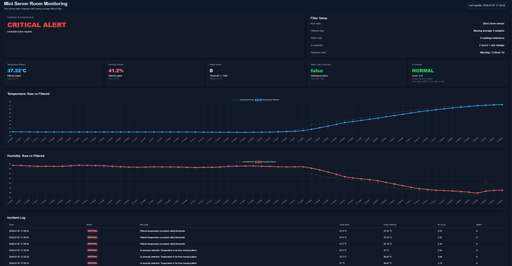
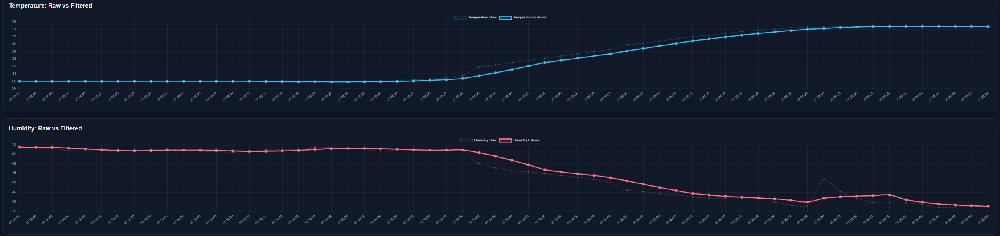
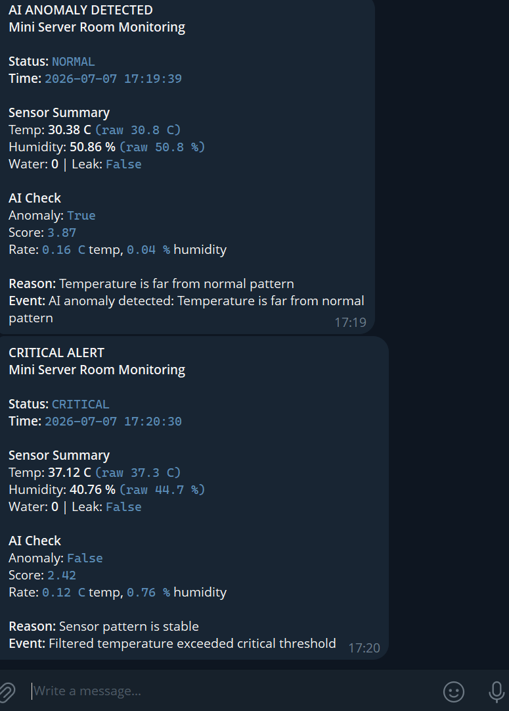

# 🌡️ Mini Server Room Monitoring

Smart room monitoring dashboard with **sensor filtering**, **anomaly detection**, **incident logging**, and **Telegram alerts**.

<p align="center">
  
  
  
  
</p>

<p align="center">
  
  
  
  
</p>

---

## 🚀 Project Overview

This project turns a normal room monitoring system into a smarter monitoring platform by adding **sensor filtering**, **dashboard visualization**, **anomaly detection**, **incident logging**, and **Telegram alerts**.

```txt
ESP32 + Sensors
      ↓
HTTP JSON
      ↓
Flask Server
      ↓
Moving Average Filter + Z-score Anomaly Detection
      ↓
Dashboard + Incident Log + Telegram Alert
```

---

## 📊 Dashboard Preview

<p align="center">
  
</p>

<p align="center">
  <b>Main dashboard showing system status, filtered sensor values, anomaly detection, and incident log.</b>
</p>

---

## 📈 Raw vs Filtered Graphs

<p align="center">
  
</p>

<p align="center">
  <b>Raw temperature and humidity data compared with moving average filtered data.</b>
</p>

---

## 📲 Telegram Alert Preview

<p align="center">
  
</p>

<p align="center">
  <b>Telegram alert message showing system status, sensor summary, AI anomaly check, and event reason.</b>
</p>

---

## ✨ Key Features

- Temperature and humidity monitoring
- Water leak detection
- Moving average filter for noisy sensor data
- Water leak debounce logic
- Z-score based anomaly detection
- Temperature and humidity rate-change detection
- Flask dashboard with Chart.js graphs
- Incident log and CSV data logging
- Telegram alert notification

---

## 🧠 System Logic

### 1. Sensor Data Collection

The ESP32 reads environmental data from sensors and sends it to the Flask server through an HTTP POST request.

Example data format:

```json
{
  "temperature": 36.44,
  "humidity": 62.94,
  "water_value": 0,
  "water_leak": false
}
```

---

### 2. Moving Average Filter

Raw temperature and humidity values are filtered using a moving average method.

```txt
Filtered value = average of the latest 5 samples
```

This helps reduce noise from sensor readings and makes the dashboard more stable.

---

### 3. Water Leak Debounce

The water leak system uses debounce logic to reduce false alarms.

```txt
Water leak is confirmed only after 2 consecutive leak readings
```

---

### 4. AI-style Anomaly Detection

The system detects abnormal sensor behavior using:

- Z-score
- Temperature rate change
- Humidity rate change

```txt
Anomaly = Z-score is too high
       or temperature changes too quickly
       or humidity changes too quickly
```

---

## 🚨 Alert Logic

| Condition | Status |
|---|---|
| Temperature < 33°C and no leak | NORMAL |
| Temperature ≥ 33°C | WARNING |
| Temperature ≥ 36°C | CRITICAL |
| Water leak confirmed | CRITICAL |
| Abnormal Z-score or rate change | AI ANOMALY |

---

## 🧩 Hardware Used

| Component | Purpose |
|---|---|
| ESP32 | Sensor node and HTTP client |
| DHT22 | Temperature and humidity measurement |
| Water sensor | Water leak detection |
| LEDs | Local system status indicator |
| Buzzer | Critical alert notification |
| Computer / Laptop | Flask server and dashboard |

---

## 🛠️ Tech Stack

| Layer | Technology |
|---|---|
| Microcontroller | ESP32 |
| Sensor | DHT22, Water Sensor |
| Backend | Python Flask |
| Frontend | HTML, CSS, JavaScript |
| Visualization | Chart.js |
| Communication | HTTP JSON |
| Alert | Telegram Bot API |
| Data Log | CSV |

---

## 📁 Project Structure

```txt
mini-server-room-monitoring/
├── README.md
├── server.py
├── requirements.txt
├── .env.example
├── esp32/
│   └── mini_server_room_esp32.ino
└── assets/
    ├── dashboard-overview.png
    ├── temperature-humidity-graphs.png
    └── telegram-alert.png
```

---

## ⚙️ How to Run

### 1. Install Python dependencies

```bash
pip install -r requirements.txt
```

### 2. Run Flask server

```bash
python server.py
```

Dashboard will run at:

```txt
http://localhost:5000
```

### 3. Upload ESP32 code

Open the Arduino file:

```txt
esp32/mini_server_room_esp32.ino
```

Edit Wi-Fi and server URL:

```cpp
const char* ssid = "YOUR_WIFI_NAME";
const char* password = "YOUR_WIFI_PASSWORD";
String serverURL = "http://YOUR_COMPUTER_IP:5000/data";
```

Then upload the code to ESP32.

---

## 🔐 Environment Variables

Telegram credentials should not be uploaded directly to GitHub.

Create a `.env` file or set environment variables:

```env
TELEGRAM_BOT_TOKEN=your_telegram_bot_token_here
TELEGRAM_CHAT_ID=your_telegram_chat_id_here
```

---

## 📡 API Endpoint

### POST `/data`

The ESP32 sends sensor data to this endpoint.

Example request:

```json
{
  "temperature": 30.5,
  "humidity": 61.2,
  "water_value": 0,
  "water_leak": false
}
```

---

## 📦 Output Logs

The Flask server automatically records data into CSV files.

| File | Description |
|---|---|
| `sensor_log.csv` | Stores all sensor readings and filtered values |
| `incident_log.csv` | Stores warning, critical, and anomaly events |

These files are useful for future analysis, troubleshooting, and predictive maintenance improvement.

---

## 💼 Engineering Value

This project shows how a normal room monitoring system can become smarter by adding:

- Sensor filtering
- Dashboard visualization
- Anomaly detection
- Telegram alerting
- Data logging
- Future predictive maintenance capability

The goal is to reduce manual checking, detect problems earlier, and support better engineering decisions.

---

## 🔮 Future Improvements

- Add database storage
- Deploy dashboard to cloud server
- Add machine learning anomaly detection model
- Add email / LINE alert
- Add multiple sensor nodes
- Add predictive maintenance dashboard
- Improve UI for mobile devices
- Add user login and system configuration page

---

## 👤 Author

**Pakinthon Chalermchai**  
Mechatronics Engineering Student, KMUTT

Building smarter engineering systems with AI, dashboards, alerts, and automation.
